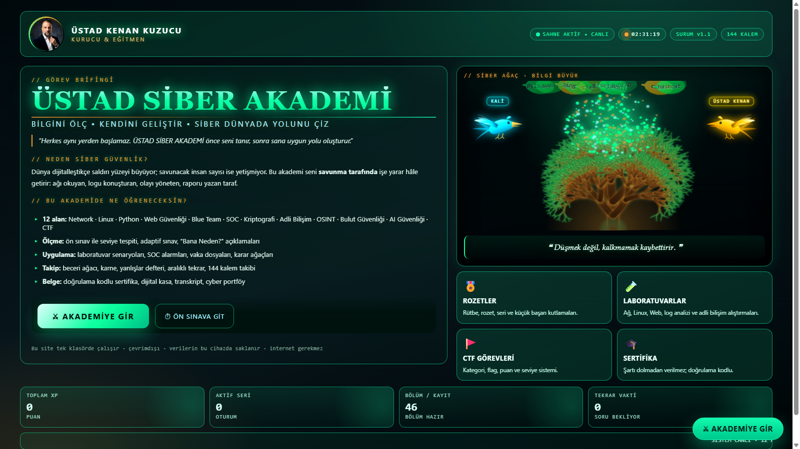
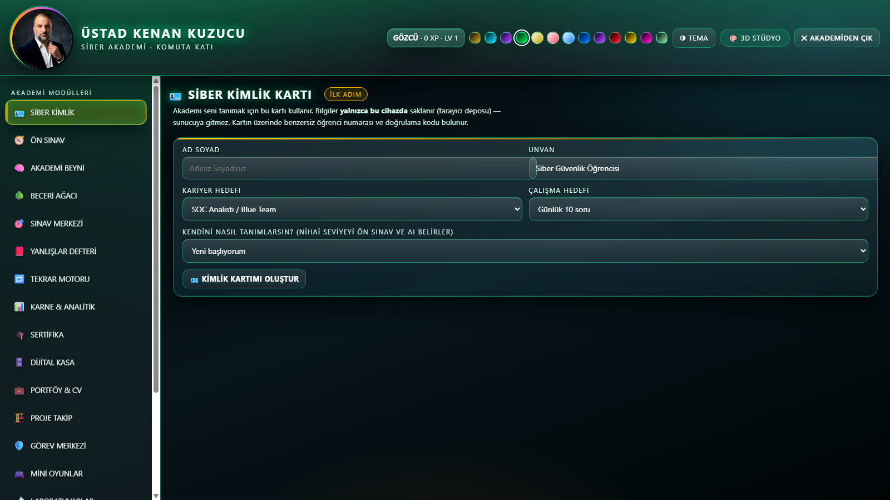
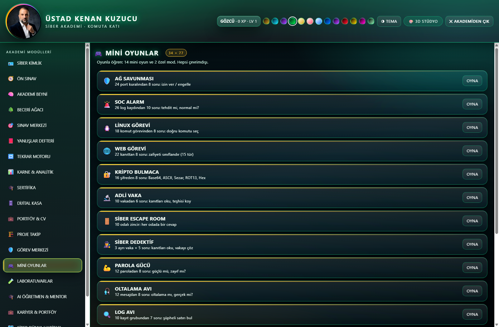
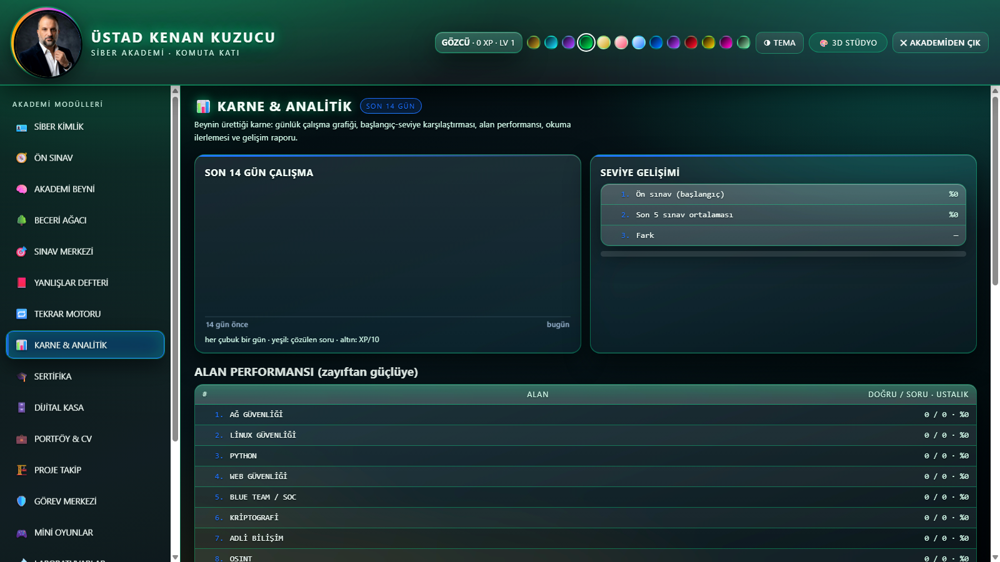

# 🎓 ÜSTAD SİBER AKADEMİ

> **Bilgili ol · kendini geliştir · siber dünyada yolunu çiz.**
> Tek klasör. Sunucu yok. İnternet yok. Her şey tarayıcıda çalışır.

Kenan Kuzucu için sıfırdan yazılmış, **tamamen çevrimdışı** çalışan bir siber güvenlik
eğitim ekosistemi: 19 modül, 1.506 soruluk banka, 14 mini oyun, laboratuvarlar, CTF tarzı
görevler, kariyer araçları ve üç boyutlu bir komuta arayüzü.



---

## ⚡ Neden farklı?

| Özellik | Ne demek |
|---|---|
| **Çevrimdışı** | Service worker + tüm veri yerel. İnternet olmadan bütün akademi çalışır. |
| **Tek dosya = tek modül** | Her modül kendi `.js` + `.css` dosyası. Bozulmaz, kolay büyür. |
| **Neo QLED görünüm** | Derin siyah zemin · saf beyaz yazı · cam (glass) paneller · zümrüt yeşili tema · neon ışıma. |
| **Gerçek puanlama** | XP, rütbe, seri, rozet, seviye. Her şey localStorage'da kalıcı. |
| **Sıfır gömülü anahtar** | API anahtarı yok; AI katmanı çevrimdışı kural motorudur. |
| **Yasal çerçeve** | Yalnız izole laboratuvar ve savunma odaklı içerik; gerçek hedefe saldırı yok. |

---

## 🧩 Modüller (19)

**1) SİBER KİMLİK** · **2) ÖN SINAV** · **3) AKADEMİ BEYNİ** · **4) BECERİ AĞACI** ·
**5) SINAV MERKEZİ** · **6) YANLIŞLAR DEFTERİ** · **7) TEKRAR MOTORU** · **8) KARNE & ANALİTİK** ·
**9) SERTİFİKA** · **10) DİJİTAL KASA** · **11) PORTFÖY & CV** · **12) PROJE TAKİP** ·
**13) GÖREV MERKEZİ** · **14) MİNİ OYUNLAR** · **15) LABORATUVARLAR** · **16) AI ÖĞRETMEN & MENTOR** ·
**17) KARİYER & PORTFÖY** · **18) SİBER DÜNYA HARİTASI 2.0** · **19) MÜFREDAT**



---

## 📚 İçerik sayıları

| Ne | Kaç |
|---|---|
| Soru bankası | **1.506 soru** (4 seçenek + açıklama) |
| Soru kategorisi | **100** |
| Veri bölümü | **46** (hepsinde sınav var) |
| Kayıt (komut, terim, konu, soru) | **4.535** |
| Eğitim alanı | **12** × 4 seviye = 48 seviye · 252 hafta |
| Mini oyun | **14** + escape room (10 oda) + dedektif (3 vaka) |
| Oyun soru/görev havuzu | **215** |
| Laboratuvar | 6 lab + CTF arena + SOC simülasyonu + karar ağacı |



---

## 🎮 Mini oyunlar (14)

**AĞ SAVUNMASI** (24 port kuralı) · **SOC ALARM** (26 log) · **LİNUX GÖREVİ** (18 komut) ·
**WEB GÖREVİ** (22 kanıt / 15 zafiyet türü) · **KRİPTO BULMACA** (16 şifre) · **ADLİ VAKA** (10 vaka) ·
**SİBER ESCAPE ROOM** (10 oda) · **SİBER DEDEKTİF** (3 vaka × 5 soru) · **PAROLA GÜCÜ** ·
**OLTALAMA AVI** · **LOG AVI** · **HASH TANIMA** · **OLAY SIRASI** · **ARAÇ EŞLEŞTİRME**



---

## 🚀 Nasıl açılır

```bash
# 1) Depoyu indir
git clone https://github.com/kenankuzucu/ustad-siber-akademi.git
cd ustad-siber-akademi

# 2) index.html dosyasına çift tıkla — hepsi bu.
#    (İstersen basit bir yerel sunucu da kullanabilirsin)
python -m http.server 8080
```

Telefona kurmak için: siteyi tarayıcıda aç → **Menü → Ana ekrana ekle** (PWA).

Adres çubuğu kısayolları: `?gir=1` (girişi atla) · `?modul=oyun` (modül aç) · `?sahne=3` (3D sahne) · `?d3=0` (3D kapat)

---

## 🗂️ Dosya düzeni

```
ustad-siber-akademi/
├─ index.html            açılış + giriş perdesi + modül yükleyici
├─ site.css  canli.css   site kimliği · canlılık katmanı
├─ akademi.css           akademi katmanı + 13 panel teması + cam/yeşil katmanı
├─ akademi.js            çekirdek: depo, XP/rütbe/rozet, menü, modül yönlendirme
├─ sahne3d.js            kendi 3D motoru (three.js)
├─ akademi-veri.js       veri: 46 bölüm · 4.535 kayıt · 1.506 soru
├─ akademi-*.js          her modül ayrı dosya (kimlik, sinav, oyun, lab, mentor, ...)
├─ akademi-agac.js/.css  siber ağaç (kod yaprakları dökülür)
├─ akademi-kus.js/.css   uçan siber kuşlar (KALİ · ÜSTAD KENAN)
├─ akademi-studyo.js    3D/4D stüdyo (26 sahne · 26 şablon · 18 tema)
├─ service-worker.js     çevrimdışı PWA
├─ ekranlar/             README görselleri
└─ KONU-TAKIP-144.txt    144 kalemlik proje defteri ve durumu
```

---

## 🛠️ Teknoloji

**Vanilla JavaScript** (çatı yok) · **three.js** (3D) · **CSS değişkenleri** (13 tema) ·
**Service Worker** (çevrimdışı) · **localStorage** (veri) · **Web Crypto / SHA-256** (kilit)

---

## 📌 Yol haritası

- [x] 19 modül · 1.506 soru · 14 mini oyun
- [x] Müfredat (12 alan × 4 seviye)
- [x] Cam + zümrüt Neo QLED arayüz
- [ ] Giriş kapısı (şifreli giriş, misafir modu, 5 hata → 60 sn kilit) — **sırada**
- [ ] Sunucu tarafı: çok kullanıcılı sürüm, online sertifika doğrulama, mentor paneli

---

## ⚖️ Etik ve yasal

Bu proje **savunma ve eğitim** amaçlıdır. İçerikteki tüm test/istismar konuları izole
laboratuvar veya yazılı izinli kapsam içindir. İzinsiz sistemlere yönelik hiçbir kullanım
desteklenmez; böyle bir kullanım suçtur. Kişisel veri toplanmaz, dış servise veri gönderilmez.

---

## 👤 Geliştirici

**Kenan Kuzucu** — Gaziantep · [@kenankuzucu](https://github.com/kenankuzucu)

Yazılım danışmanlığı ve tasarım desteğiyle geliştirildi (Hermes Agent / Nous Research).
